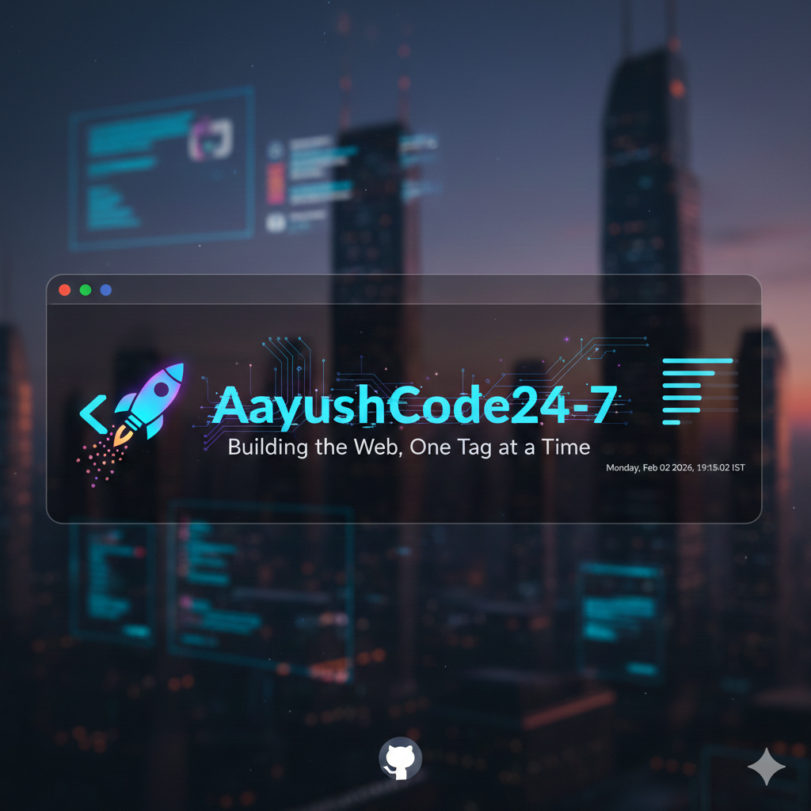

  

## 👋 Hi, I'm Aayush! 
**Tech Enthusiast | Coder | AI & GUI Explorer** I love building practical projects that solve real-world problems. From managing flight records to competitive programming, I'm always looking for the next challenge.

---

### 🚀 My Digital Lab
- 🔭 **Featured Project:** [Airline-Information-System](https://github.com/AayushCode24-7/Airline-Information-System) - A Python-based console app for flight management.
- 🌱 **Currently Leveling Up:** My Frontend skills through [Html_Work](https://github.com/AayushCode24-7/Html_Work).
- 🏆 **Competitive Programming:** Solving problems on [CodeForces](https://github.com/AayushCode24-7/CodeForces).
- ⚡ **Fun Fact:** I'm a "24/7" coder who believes practical projects are the best way to learn!

---

### 💻 Tech Stack

---

### 📊 My GitHub Journey

  

---

### 📫 Connect with Me

